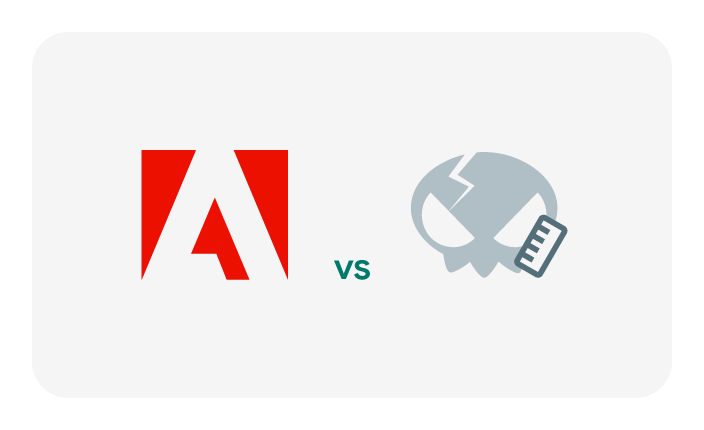

# Adobe Icons Remake (Canary)

Adobe product icons are in their second breath – smoother and more aesthetically pleasing.

## What's included in the package?
Done icons:
* Acrobat
* After Effects
* Animate
* Audition
* Character Animator
* Express
* Fonts
* Fresco
* illustrator
* InCopy
* InDesign
* Lightroom Classic
* Lightroom
* Media Encoder
* Photoshop Camera
* Photoshop Express
* Photoshop
* Premiere
* XD

Every icon have the following dimensions:
* 16 px
* 20 px
* 24 px
* 32 px
* 40 px
* 48 px
* 64 px
* 72 px
* 80 px
* 96 px
* 128 px
* 512 px
* 786 px

## Applying
Use an icon from the repository as an image source for the desired object.

# Gratitude
Thanks to [**Adobe**](https://www.adobe.com/) for the source images.

# License
```
Read the "LICENSE" file.
```